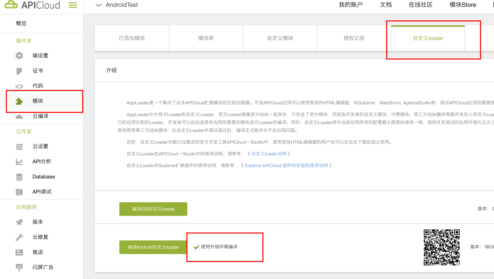
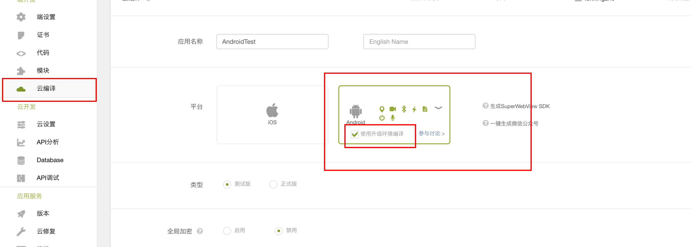

# APICloud-growingio 集成文档
### 1.使用此模块前先配置config.xml文件,方法如下
- 名称：GrowingIO
- 必要参数: accountId, urlScheme
- 可选参数: trackerHost, reportHost, dataHost, gtaHost, wsHost, zone


```
<feature name="GrowingIO">
<param name="android_accountId" value="xxxxx"/>
<param name="ios_accountId" value="xxxx"/>
<param name="ios_urlScheme" value="xx ios项目的urlScheme  xx"/>
<param name="android_urlScheme" value="xx android项目的urlScheme  xx"/>
<param name="trackerHost" value="xxxxx"/>
<param name="reportHost" value="xxxxx"/>
<param name="dataHost" value="xxxxx"/>
<param name="gtaHost" value="xxxxx"/>
<param name="wsHost" value="xxxxx"/>
<param name="zone" value="xxxxx"/>
<param name="channel" value="xxxx"/>
<param name="debug" value="true or false"/>
</feature>
<preference name="urlScheme" value=" xx ios项目的urlScheme  x " />
<preference name="urlScheme" value=" xx android项目的urlScheme  x " />
```

**注意preference的urlScheme需要配置两个， 一个为Android项目的， 另一个为IOS项目的， 如果只有一个平台填写自己相应平台的即可, 同理feature中的android_urlScheme与ios_urlScheme**

**注意preference中 ios项目的urlScheme在前,android项目的urlScheme在后,需要保证顺序**

### 2.下载模块zip包
iOS: [link](https://github.com/growingio/APICloud-growingio/blob/develop/iOS/iOS/GrowingIO_iOS.zip)

Android: [link](android/GrowingIO.zip)

### 3.添加模块
开发控制台 -> 选择应用 -> 模块 -> 自定义模块 -> 点击上传 -> 编写自定义模块信息(注意:模块名称要和zip包名称一致)-> 点击添加模块 "+" -> 在已添加模块中确认是否成功添加

### 4.Android的额外操作
Android 云编译Loader为AppLoader， 使用自定义模块式需要编译Android自定义loader, 否则会出现模块未绑定错误, 另外需要注意的是在使用自定义loader时 请勾选 **使用升级环境编译** 选项

具体步骤如下: 
1. 模块-自定义loader: 请勾选 **使用升级环境编译**
   
   
2. 云编译时， 请勾选 **使用升级环境编译**
   
   

### 5.方法
1.init()  
**此接口为Android初始化， 在require后调用， iOS不需要， iOS已自动初始化**
建议在require GrowingIO时调用此接口

```js
    var gio = null;
	apiready = function(){
	    gio = api.require('GrowingIO');
	    gio.init();
	}
```

2.track(event, callback)

| 参数名 | 类型 | 是否必填 | 参数描述 |
|-----|-----|-----|----|
| event | object | 是 | key:eventId(string类型,必要key) value:(string类型) <br>key:eventLevelVariable(string类型,非必要key) value:(object类型) <br>key:number(string类型, 非必要key) value(number类型) |
| callback | 函数 | 否 | callback {function (ret)}：执行完读取操作后的回调函数。<br>ret 为 callback 函数的参数，有两个属性:<br>status:结果2种 true, false 都为布尔类型 <br>msg:结果string类型 |

3.setEvar(conversionVariables, callback)

| 参数名 | 类型 | 是否必填 | 参数描述 |
|-----|-----|-----|----|
| conversionVariables | object | 是 |  |
| callback | 函数 | 否 | callback {function (ret)}：执行完读取操作后的回调函数。<br>ret 为 callback 函数的参数，有两个属性:<br>status:结果2种 true, false 都为布尔类型 <br>msg:结果string类型 |

4.setPeopleVariable(peopleVariables, callback)

| 参数名 | 类型 | 是否必填 | 参数描述 |
|-----|-----|-----|----|
| peopleVariables | object | 是 |  |
| callback | 函数 | 否 | callback {function (ret)}：执行完读取操作后的回调函数。<br>ret 为 callback 函数的参数，有两个属性:<br>status:结果2种 true, false 都为布尔类型 <br>msg:结果string类型 |

5.setUserId(userIdObject, callback)

| 参数名 | 类型 | 是否必填 | 参数描述 |
|-----|-----|-----|----|
| userIdObject | object | 是 | key:userId(string类型,必要key) value:(string或者number类型) |
| callback | 函数 | 否 | callback {function (ret)}：执行完读取操作后的回调函数。<br>ret 为 callback 函数的参数，有两个属性:<br>status:结果2种 true, false 都为布尔类型 <br>msg:结果string类型 |

6.clearUserId(callback)

| 参数名 | 类型 | 是否必填 | 参数描述 |
|-----|-----|-----|----|
| callback | 函数 | 否 | callback {function (ret)}：执行完读取操作后的回调函数。<br>ret 为 callback 函数的参数，有两个属性:<br>status:结果2种 true, false 都为布尔类型 <br>msg:结果string类型 |

### 6.Tips
**iOS**  
1. 提示无法检测到urlScheme?  
anser: (1)查看config.xml是否配置正确 (2)需要同步代码到云端,云编译生效

2. 模拟器无法test?  
anser: 只能真机测试

3. 如何查看发送的数据?  
anser: 您可以使用GrowingIO官网提供的mobileDebugger工具来查看

4. 此模块是否包含IDFA?  
anser: 包含IDFA, GrowingIO 使用 IDFA 来做来源管理激活设备的精确匹配，让你更好的衡量广告效果。 

5. 官网web提示未检测到sdk?    
anser: 请使用正式版包来操作几次

App Store 提交应用注意事项  
GrowingIO会启用 IDFA，所以在向 App Store 提交应用时，需要：
- 对于问题 **Does this app use the Advertising Identifier (IDFA)**，选择 **YES**。
- 对于选项**Attribute this app installation to a previously served advertisement**，打勾。
- 对于选项**Attribute an action taken within this app to a previously served advertisement**，打勾。
